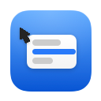
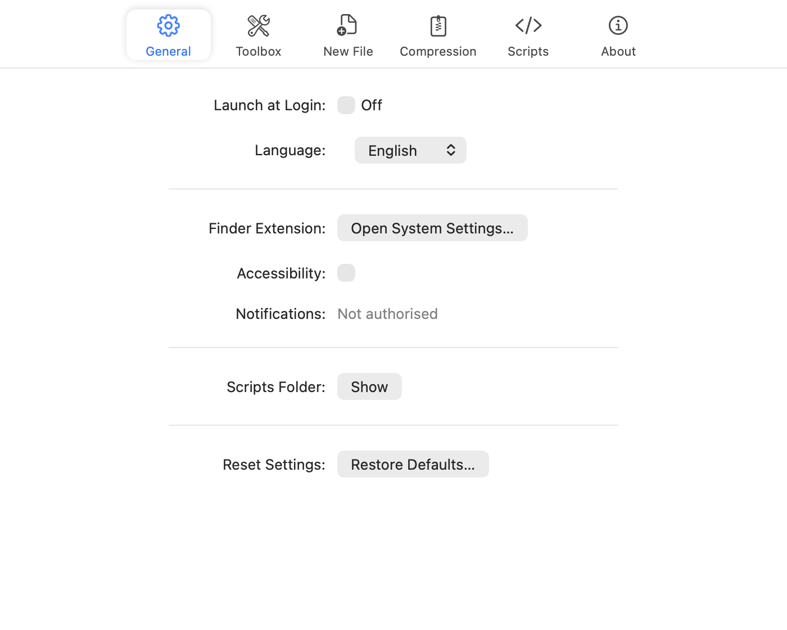

  

<h1 align="center">RightKit</h1>

The actions you reach for most, in Finder's context menu.

  
  
  

  <a href="README.md">中文</a> ·
  <a href="README.enUS.md">English</a>

RightKit is a Finder context menu extension for macOS. Create a file from a template, copy a path, compress and extract, run your own scripts — and reorder or switch off any of them.

It runs as an agent app: no Dock icon, no window at launch. Settings open from the status bar icon.

## ✨ Features

Archive entries follow the selection: extracting never appears for a plain folder, and compressing never appears when everything selected is already an archive.

| Action | Applies to | What it does |
|---|---|---|
|  **New File** | empty space | Creates a file from a template and goes straight into rename; your own templates work too |
|  **Copy Path** | selection, empty space | Copies the absolute path |
|  **Copy File Name** | selection | Copies the name alone |
|  **Open Terminal Here** | selection, empty space | Opens Terminal in this very folder |
|  **Scripts** | selection, empty space | Runs the scripts you put in the scripts folder |
|  **Compress to ZIP** | selection | Packs with the compressor you chose |
|  **Compress to 7Z** | selection | Needs Keka; hidden when it is not installed |
|  **Extract Here** | archives | Extracts into the current folder |
|  **Extract into Separate Folder** | archives | Extracts into a new folder named after the archive |

## 📸 Screenshots

## 📦 Download

Get the latest build from [Releases](https://github.com/dozecat/rightkit/releases), open it and drag **RightKit** into your Applications folder.

On first launch RightKit opens its self-check panel, which says what is still missing and takes you to where it is switched on.

### Three things to turn on the first time

| What | Where | Why |
|---|---|---|
| **Finder extension** | System Settings → Privacy & Security → Extensions | Without it no menu items appear at all |
| **Accessibility** | System Settings → Privacy & Security → Accessibility | New File goes straight into rename, and that needs it |
| **Keka folder access** | Keka → Settings → File Access → Enable access to the home folder | Only for 7z; without it Keka cannot touch your files |

## License

[GNU General Public License v3.0](LICENSE). RightKit is free software, and any redistributed derivative must stay open under the same licence.
