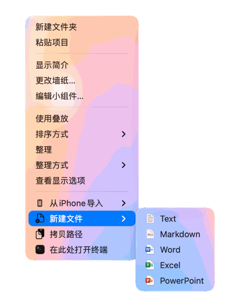
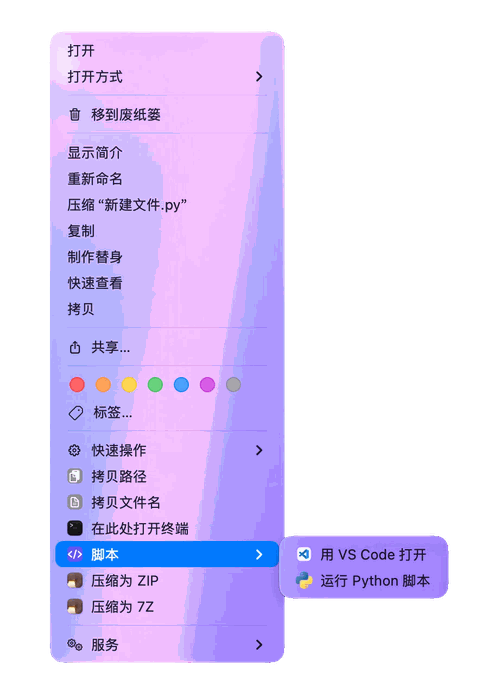
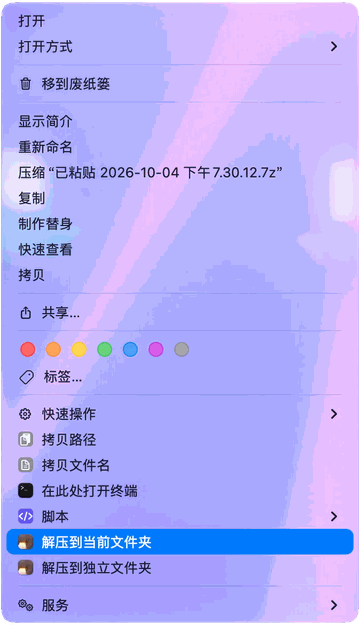

<p align="center">
  <a href="https://github.com/dozecat/rightkit">
    
  </a>
</p>

<h1 align="center">RightKit</h1>

<p align="center">
  The actions you reach for most, in Finder's context menu.
</p>

<p align="center">
  <a href="https://github.com/dozecat/rightkit/releases"></a>
  
  
  <a href="LICENSE"></a>
</p>

<p align="center">
  <a href="README.md">中文</a> ·
  <a href="README.enUS.md">English</a>
</p>

<p align="center">
  <a href="https://github.com/dozecat/rightkit/releases">Download</a> ·
  <a href="docs/DESIGN.md">Design doc</a> ·
  <a href="https://github.com/dozecat/rightkit/issues">Feedback</a>
</p>

**RightKit is a lightweight Finder enhancement for macOS.** Finder's own context menu is plain, and extending it usually means a third-party tool; RightKit is the lighter kind: just new file, copy path, open Terminal here, and compress/extract, shown only for what you have selected.

It bundles no archiver: you choose between the system's own tools and [Keka](https://keka.io), and the menu's compress and extract options follow whatever that choice supports. And when those are not enough, write a shell script and drop it in the scripts folder — it becomes a menu item of its own.

## ✨ Features

-  **New File**: right-click empty space to create a file from a template and go straight into rename. Five templates ship with it — text, Markdown, Word, Excel, PowerPoint — and a file of your own becomes a template too.
-  **Copy Path**: copies the absolute path, one per line for a multi-selection; on empty space it copies the current folder.
-  **Copy File Name**: appears with a selection only, and copies the name without the path.
-  **Open Terminal Here**: opens Terminal in the current folder — a selected folder itself, or the folder holding a selected file.
-  **Scripts**: runs the scripts in the scripts folder that match the current selection, and hides itself when none do; any executable `script.sh` you drop in becomes a menu item.
-  **Compress to ZIP**: packs with the archiver chosen in Settings, adding a number when the result name is taken.
-  **Compress to 7Z**: appears only when the chosen archiver supports 7z.
-  **Extract Here**: unpacks in place, with no new folder.
-  **Extract into Separate Folder**: unpacks into a new folder named after the archive, again with a number when the name is taken.

Beyond the list, each item's toggle and order are managed in Settings and reach Finder the moment you change them; the settings window and the context menu both switch between English and Simplified Chinese instantly.

## 📸 Screenshots

| New File | Scripts | Extract |
|---|---|---|
|  |  |  |

## 📦 Download & Install

**[Download the latest release](https://github.com/dozecat/rightkit/releases)**, open it, and drag **RightKit** into your Applications folder. It needs macOS 13 Ventura or later. On first launch a self-check panel appears once, says what is still missing, and takes you to where each item is switched on.

> **This build is not notarized by Apple**, so macOS will say it cannot verify the developer. To open it the first time, right-click RightKit and choose **Open**, then **Open** again in the dialog — or allow it under **System Settings → Privacy & Security**. You can also run `xattr -dr com.apple.quarantine /Applications/RightKit.app` in Terminal.

What to turn on the first time:

| What | Where |
|---|---|
| **Finder extension** | System Settings → General → Login Items & Extensions → Finder Extensions |
| **Accessibility** | System Settings → Privacy & Security → Accessibility |
| **Keka folder access** | For 7z only: Keka → Settings → File Access |
| **Notifications** (optional) | The prompt on first run; reports what compress, extract, and scripts did |

> On older versions of macOS the Finder extension lives under **Privacy & Security → Extensions**. When you are not sure what is missing, open **Check Status…** from the menu bar icon.

**Updating**: download a new version and install it over the old one; there is no automatic updater yet. **Uninstalling**: turn off the Finder extension and drag RightKit to the Trash — scripts, templates and logs live in `~/Library/Application Support/RightKit/` and `~/Library/Logs/RightKit/` if you want them gone too.

## 🧩 Scripts

The **Scripts** submenu in the context menu lists the scripts that match your selection; click one to run it, and the whole item is hidden when nothing matches. Two ship with the app: **Open in VS Code** and **Run Python**.

To add your own, drop a script package into the scripts folder (Settings → Scripts → `+` opens that folder for you) — the folder is the single source of truth, with no import step in the app.

```
~/Library/Application Support/RightKit/Scripts/
└── Open in VS Code/
    ├── script.sh      # entry point, needs chmod +x
    ├── config.json    # metadata, optional
    └── icon.png       # icon, optional
```

A minimal `script.sh`:

```bash
#!/bin/bash
# The selected paths arrive as arguments; the working directory
# is the folder you right-clicked in.
for f in "$@"; do
    echo "$f" >> "$RIGHTKIT_DIR/selected.txt"
done
```

`config.json` decides when it appears — the fields you will actually use:

| Field | Value | Meaning |
|---|---|---|
| `name` | string | The name shown in the menu |
| `context` | `selection` / `files` / `folders` / `background` / `all` | Applies to the selection, files, folders, empty space, or everything |
| `extensions` | e.g. `["py"]` | Appears only for a selection with these extensions |
| `confirm` | `true` | Ask for confirmation before running |
| `icon` | file name | An icon file inside the package |
| `order` | number | Position within the submenu |

At run time the selection arrives as `$@`, `RIGHTKIT_DIR` (the folder you right-clicked in) and `RIGHTKIT_FILES` (the selected paths, newline-separated) are in the environment, each script gets a 300-second timeout, and every run is logged to `~/Library/Logs/RightKit/Scripts/<script name>/`.

> **About PATH**: scripts are launched by the XPC service, which inherits launchd's minimal environment — only `/usr/bin:/bin:/usr/sbin:/sbin`. To use a Homebrew `python3` or `node`, add `export PATH="/opt/homebrew/bin:$PATH"` at the top of the script yourself.

For the remaining fields and how the built-in scripts are seeded, see the [design doc](docs/DESIGN.md) (Chinese).

## Feedback

Questions, bugs, and ideas are all welcome in [Issues](https://github.com/dozecat/rightkit/issues). Including your macOS version, the RightKit version, and what the self-check reports makes it much faster to sort out.

To build it yourself, or to work out why a rebuilt extension is not refreshing, see the [build guide](docs/BUILDING.md) (Chinese).

## 📄 License

[GNU General Public License v3.0](LICENSE). RightKit is free software, and any redistributed derivative must stay open under the same licence.
