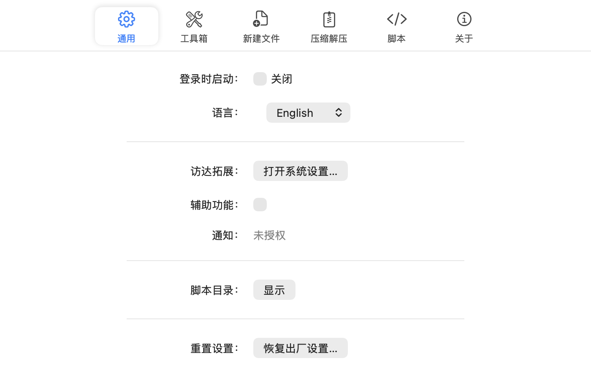

<p align="center">
  
</p>

<h1 align="center">RightKit</h1>

<p align="center">把最常用的操作放进 Finder 的右键菜单。</p>

<p align="center">
  <a href="https://www.apple.com/macos/"></a>
  <a href="https://swift.org/"></a>
  
  <a href="https://developer.apple.com/xcode/"></a>
  <a href="LICENSE"></a>
</p>

<p align="center">
  <a href="README.md">中文</a> ·
  <a href="README.enUS.md">English</a>
</p>

RightKit 是 macOS 上的 Finder 右键增强工具。按模板新建文件、拷贝路径、压缩解压、运行自己的脚本，每一项都可以排序或关掉。

它以代理应用的形式运行：没有 Dock 图标，启动时不弹窗。设置从状态栏图标进入，右键菜单由 Finder Sync 扩展构建。

## ✨ 功能

归档项跟着选中的内容走：选中普通文件夹不会出现解压，选中的全是压缩包时不会出现压缩。

| 操作 | 作用于 | 说明 |
|---|---|---|
|  **新建文件** | 空白处 | 按模板建文件并直接进入重命名。文本与 Markdown 由代码生成；Word、Excel、PowerPoint 是内置的空文档。自己的模板放进模板目录即可 |
|  **拷贝路径** | 选中项、空白处 | 绝对路径，两种情境下叫法一致 |
|  **拷贝文件名** | 选中项 | 只要文件名 |
|  **在此处打开终端** | 选中项、空白处 | 选中的是文件夹就在它自己里打开，是文件则在它所在的文件夹打开 |
|  **脚本** | 选中项、空白处 | 运行脚本目录里的脚本站，在 XPC 服务中隔离执行 |
|  **压缩为 ZIP** | 选中项 | 用你选定的压缩软件：Keka，或系统自带的 `zip` |
|  **压缩为 7Z** | 选中项 | 仅 Keka。所选软件写不了 7z 时这一项自动隐藏 |
|  **解压到当前文件夹** | 压缩包 | 就解压在当前目录 |
|  **解压到独立文件夹** | 压缩包 | 解压到以压缩包命名的新文件夹 |

- **工具箱**——拖动排序，任意一项都能关掉。设置窗口里的顺序就是菜单里的顺序。
- **自检**——报告访达扩展是否启用、权限是否齐全、共享容器可不可写、菜单快照是否新鲜，缺什么就给什么按钮。
- **语言**——简体中文或 English，切换后立即生效，右键菜单跟随同一个设置。
- **压缩软件**——选 Keka 用它，否则用系统自带工具。能力列表从所选应用读取，菜单也跟着所选软件走。

## 🏗 结构

四个 target。扩展是沙盒的，主应用不是。

| 组件 | 说明 |
|---|---|
| **RightKit**（`RightKit/`） | 主应用——设置界面、状态栏图标，以及所有文件操作 |
| **FinderExtension**（`FinderExtension/`） | 沙盒化的 Finder Sync 扩展——构建菜单、写出操作请求 |
| **ScriptXPCService**（`ScriptXPCService/`） | 执行脚本站，只有主应用能连接 |
| **Shared** / **AppCore** | 三个进程共用的模型、存储与 IPC；主应用使用的业务逻辑 |

因为扩展是沙盒的，任何要碰路径的操作——新建文件、压缩、打开终端——都通过一个请求文件加 `rightkit://action/<uuid>` 唤起主应用来做，脚本再由主应用交给 XPC 服务。扩展自己不连 XPC。

## 📸 截图

<p align="center"></p>

## 📦 安装

### 从源码构建

Xcode 工程是生成的，不入库。

```bash
git clone git@github.com:dozecat/rightkit.git
cd rightkit
brew install xcodegen
xcodegen generate
open RightKit.xcodeproj        # 然后 ⌘R
```

首次启动时 RightKit 会打开自检面板，并提示启用访达扩展。之后每次重新构建扩展都要重载：

```bash
Scripts/reload-finder-extension.sh
```

### 权限要求

| 需要什么 | 为什么 |
|---|---|
| **访达扩展** | 在 系统设置 → 隐私与安全性 → 扩展 里启用。没有它菜单里不会出现任何项目 |
| **辅助功能** | 「新建文件」后要进入行内重命名，需要这个权限。首次使用时会请求 |
| **Keka 文件夹访问** | 只有选了 Keka 且要用 7z 时才需要。在 Keka → 设置 → 文件访问权限 里开启「启用主文件夹访问权限」，否则它的命令行碰不到你的文件 |

## 🔧 开发

```bash
xcodegen generate

TMPDIR=$PWD/.build/tmp/ xcodebuild -project RightKit.xcodeproj -scheme RightKit \
  -configuration Debug -destination 'platform=macOS,arch=arm64' \
  -derivedDataPath .build/dd build-for-testing CODE_SIGNING_ALLOWED=NO

TMPDIR=$PWD/.build/tmp/ xcrun xctest .build/dd/Build/Products/Debug/RightKitTests.xctest
```

### 关键技术

- **Swift 5.9** 与 SwiftUI，只在平台必需处使用 AppKit
- **FinderSync** 构建右键菜单，具体操作交给主应用，通过 App Group 请求文件传递
- **XPC**（`ScriptXPCService`）把用户脚本隔离在主应用与扩展之外运行
- **XcodeGen**——`project.yml` 才是工程本身，`.xcodeproj` 是生成物

### 🌐 本地化

| 语言 | 代码 |
|---|---|
| **简体中文** | `zh-Hans` |
| **English** | `en` |

`Localizable.xcstrings` 的源语言是中文，所以它的 key 就是中文字符串，编译出来的只有 `en.lproj` 一份译文。字符串在渲染时按所选语言去对应的 bundle 里查，这就是切换语言能立即生效、而不用重启应用的原因。

## 同类项目

- [RClick](https://github.com/wflixu/RClick)——同样是 Finder 右键扩展，架构相近

## 许可

[GNU General Public License v3.0](LICENSE)。RightKit 是自由软件：你可以依据 GPL-3.0 的条款重新分发和修改它，任何再分发的衍生版本都必须同样以 GPL-3.0 开源。
